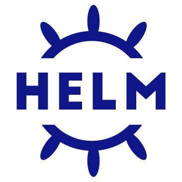

<br>
<p align="center">

<br><br>
<br>

# Helm - Быстрый старт
Еще больше полезной информации - [Youtube](https://www.youtube.com/channel/UCqC3c7UHtwoX2wy7fdHc6gg) и [Telegram](https://t.me/devops_mops)

<br>

**Helm** - пакетный менеджер для Kubernetes

<br>

## Содержание
- [Установка Helm](Установка-Helm)
- [Репозитории и артефакты](#Репозитории-и-артефакты)
- [Установка и обновление](#Установка-и-обновление)
- [Управление релизами](#Управление-релизами)
- [Создание собственных чартов](#Создание-собственных-чартов)

<br>

## Установка Helm

Последние релизы Helm<br>
https://github.com/helm/helm/releases

macOS
```
brew install helm
```

Windows
```
choco install kubernetes-helm
```

Linux
```
curl -fsSL -o get_helm.sh https://raw.githubusercontent.com/
helm/helm/master/scripts/get-helm-3

chmod 700 get_helm.sh

./get_helm.sh
```
<br>

## Репозитории и артефакты

> Файл чарта также называют артефактом

Популярные репозитории:
- Artifact Hub
https://artifacthub.io/
- Bitnami
https://bitnami.com/
- Репозиторий на GitHub больше не поддерживается

Добавить репозиторий Artifact Hub
```
helm repo add stable https://charts.helm.sh/stable
```

Добавить репозиторий Bitnami
```
helm repo add bitnami https://charts.bitnami.com/bitnami
```

Показать подключенные репозитории
```
helm repo list
```
<br>

Обновить список чартов
```
helm repo update 
```
<br>

Поиск чарта на Artifact Hub
```
helm search hub <key_word>
```
<br>

Поиск чарта в подключенных репозиториях
```
helm search repo <key_word>
```
<br>

Загрузить чарт из репозитория
```
helm fetch <chart_name>
```
или
```
helm pull <chart_name>
```

Загрузить чарт из репозитория и распоковать в текущую папку
```
helm pull --untar <chart_name>
```
<br>


Получить всю информацию из чарта
```
helm show <option> <chart_name>
```
Команда поддерживает опции:
> all<br>
> hooks<br>
> manifest<br>
> notes<br>
> values<br>

<br>

Получить всю информацию из чарта
```
helm show all <my_chart.tgz>
```
<br>

Получить values из чарта и сохранить локально
```
helm show values <chart_name> > values.yaml
```
<br>

## Установка и обновление

Установить релиз
```
helm install <release_name> <chart_name> --namespace <namespace_name>
```
или
```
helm upgrade -i <release_name> <chart_name> --namespace <namespace_name>
```

> Ключ -f позволяет указать определенный файл values

<br>

> Необходимо указать имя релиза (уникально в пределах namespace) или ключ ***--generate-name***

<br>

Установить релиз из архива чарта

```
helm install <release_name> my_chart.tgz
```
<br>

Обновление релиза

> При обновлении ключ -i не указываем

```
helm upgrade <release_name> <chart_name>
```
<br>

## Управление релизами
Показать список установленных релизов
```
helm list 
```
или
```
helm ls
```
<br>

> Чтобы вывести все релизы (даже если статус отличается от DEPLOYED) укажите ключ ***--all***

<br>

Показать список установленных релизов в определенном namespace
```
helm ls --namespace <namespace_name>
```
<br>

Вывести информацию о релизе
```
helm get <option> <release_name>
```
Команда поддерживает опции:
> all<br>
> hooks<br>
> manifest<br>
> notes<br>
> values<br>

<br>

Откат к предыдущей версии релиза
```
helm rollback <release_name> <revision>
```
<br>

Удалить установленный релиз
```
helm uninstall <release_name>
```
или
```
helm delete <release_name>
```
> Ключ ***--keep-history*** сохраняет историю релизов и позволяет выполнить rollback

<br>

## Создание собственных чартов

Создать шаблон для своего чарта в папке ./my-chart
```
helm create my-chart
```
<br>

Выполнить проверку файлов чарта в текущей папке
```
helm lint
```
<br>

Создать чарт, используя файлы из папки ./my-chart
```
helm package my-chart
```
<br>

## Плагины

Установить плагин
```
helm plugin install
```

Показать установленные плагины
```
helm plugin list
```

Обновить плагин
```
helm plugin update
```

Удалить плагин
```
helm plugin uninstall
```
<br>

**Популярные плагины:**

- [helm-2to3](https://github.com/helm/helm-2to3)<br>
Плагин поможет конертировать ваши чарты для Helm2 в чарты для Helm3
- [helm-diff](https://github.com/databus23/helm-diff)<br>
Плагин показывает разницу между текущим состоянием релиза и состоянием после обновления из указанного чарта
- [helm-env](https://github.com/adamreese/helm-env)<br>
Плагин показывает переменные окружения Helm
- [helm-kubeval](https://github.com/instrumenta/helm-kubeval)<br>
Плагин для проверки соответствия чартов схемам Kubernetes

## Полезные ссылки

- [The Chart Best Practices Guide](https://helm.sh/docs/chart_best_practices/)
- [Awesome Helm](https://github.com/cdwv/awesome-helm)

<br>

---

Еще больше полезной информации - [Youtube](https://www.youtube.com/channel/UCqC3c7UHtwoX2wy7fdHc6gg) и [Telegram](https://t.me/devops_mops)